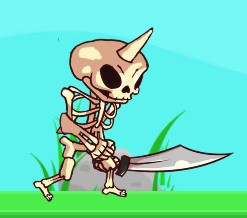
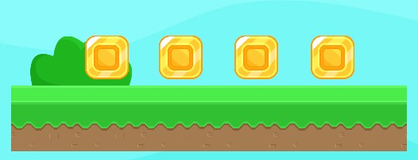

# Unity-GameBuilder
A simple platformer game builder with preconfigured assets and basic game mechanics for easier level design.

In this project you will have preconfigured main character, enemies, coins, etc. which you can directly use to build your own level in a new scene. There is also a sample level you can see for more details. But make sure to run the game from MaineMenu Scene.

# Game Screenshots:
## Main Menu:

It is just a random title for the game XD. 
In the bottom left corner there are 2 buttons for toggling background music and sound effects on or off.

## Game Screens:

## Main Character

This character has different movements. It can run, jump or stay idle. If you hold jump button longer it will jump higher. If you stay idle for long enough it will blink ;). 
It can kill enemies by jumping directly on their heads. But, it will die if it touched the enemy's body or fell into water or touched a spike. 
There are different sound effects and 5 different animations for this character like Idle, Run, Jump, Fall, Die.

## Skeleton Zombie:

This is the enemy in the game. It will die if main character jumped on its head. It will kill main chracter on contact. 
<strong>The best thing about this is it will roam on the platform it has been placed on covering it completely. It is controlled by a basic AI Script. You don't need to provide any other information about the length of the plank or anything like that. Just place it on top of a hanging platform and it will start patroling it.</strong> 
There are different sound effects and 2 different animations for this character Walk, Die.

## Coins:

These are coins which our main chracter can collect while avoiding or killing zombies. To collect, character just needs to touch a coin and it will fly towards the top right corner of the screen increasing the score by 1. There is a nice collect sound effect and spinning animation for the coins.

## Parallax Background:
As you might have noticed, background has some mountain sprites. It has a parallax effect which will be apparent when you play the game.

## Other:
Other than above mentioned assets, there are spikes, water bodies which will also kill our character. 
There are additional bush, stone and tree sprites I have used in my level. They are just for detailing the game more and can be found in Free Assets Folder.  

I hope you like it. Feel free to share your suggestions :))
